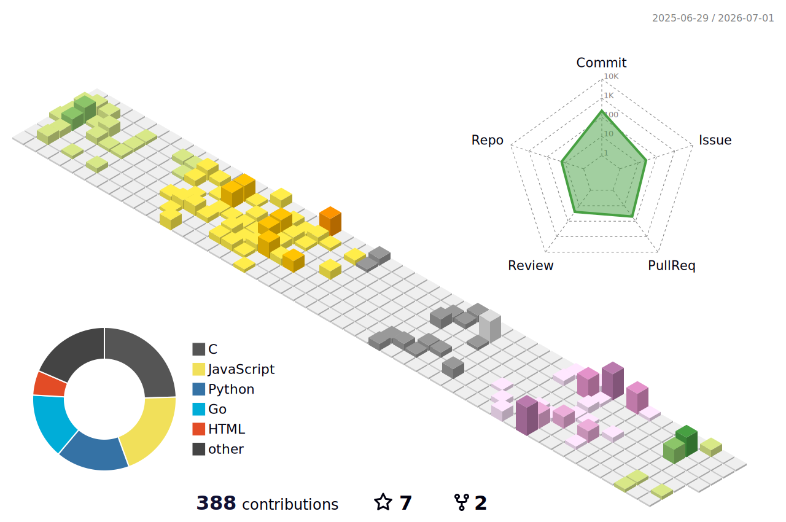

## hello, i'm thomas (deglebe)

computer science student, hobby developer, runner

#### me:
- currently learning about compiler design
- how to reach me: `git at tdbio dot me`
- language proficiency: english (native), scots (native), shaetlan (conversant), german (working proficiency)

#### featured projects:
- [6502](https://github.com/deglebe/6502) - student project: 6502 emulator in c
- [sudoku](https://github.com/deglebe/sudoku) - native sudoku with builtin puzzle generation and lua moddability
- [got](https://github.com/deglebe/got) - tui git staging/commit manager
- [vimwm](https://github.com/degelebe/vimwm) - use vimserver/perl as your x11 window manager

  
stats

  

      
  

